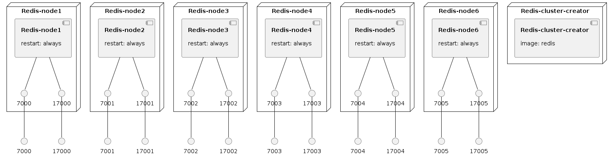

# How to create local redis cluster

> `en0` is your network interface that you're using right now.

```bash
ip=$(ipconfig getifaddr en0) docker-compose up -d --build
```


### Infrastructure model

